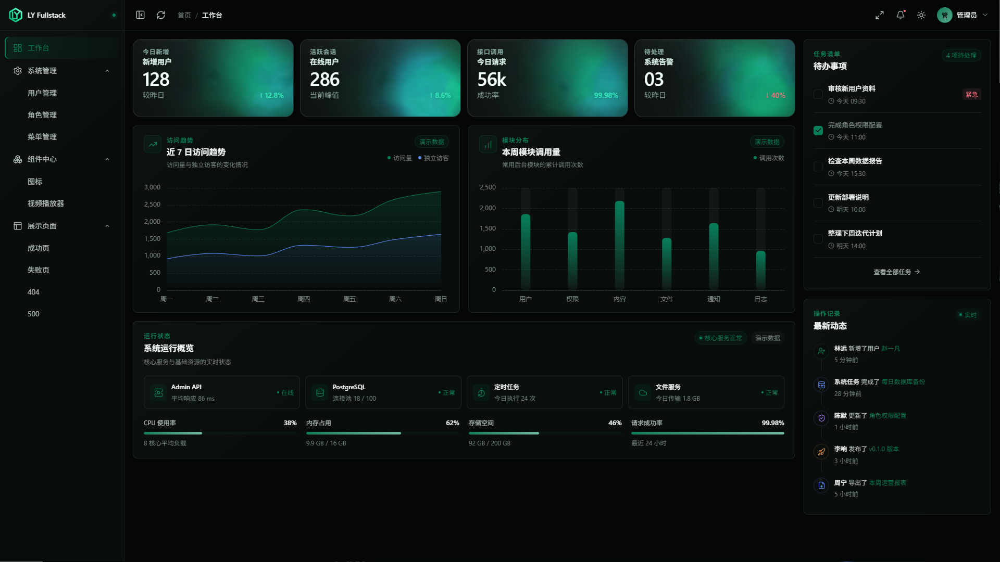
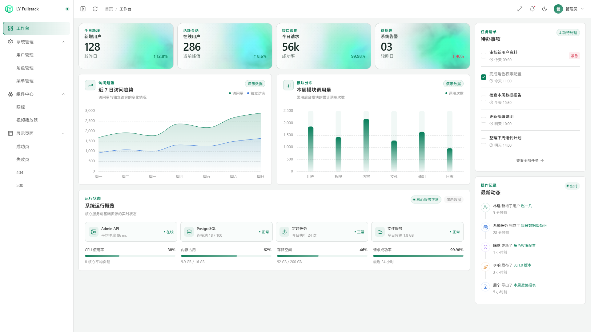
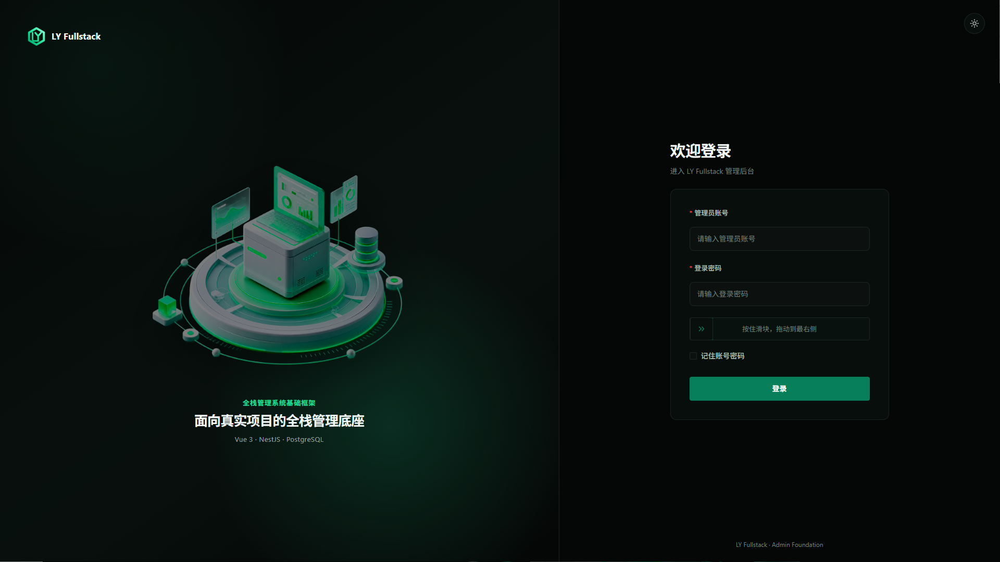
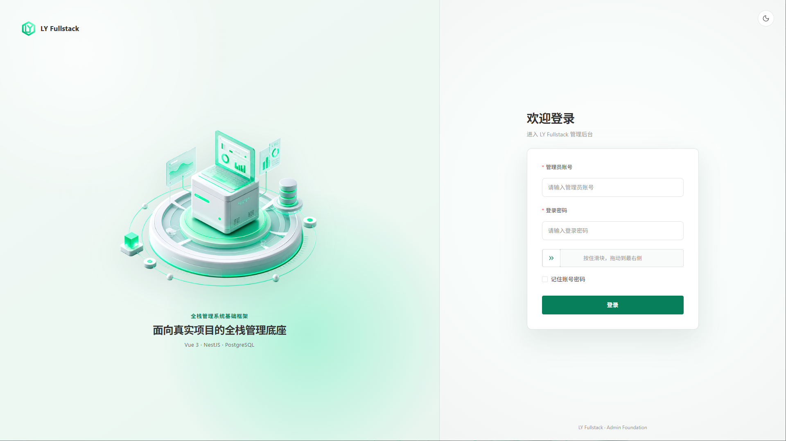

# LY Fullstack

[](https://github.com/liangy0323/ly-fullstack/actions/workflows/ci.yml)
[](LICENSE)
[](docs/releases/v0.1.0.md)

面向开源展示与真实项目的通用全栈解决方案。

当前已经完成管理后台基础闭环：登录认证、动态菜单、用户/角色/菜单管理、五表 RBAC、数据库迁移与种子数据均已真实贯通；后续阶段聚焦业务组件、示例模块和部署方案，不把尚未实现的终端业务能力算入现有范围。

## 核心思想

具体的 C 端业务无法被一套仓库提前定义：它可能是小程序、SSR 官网、单页应用、移动端，也可能是某个垂直场景的功能型产品。但无论 C 端产品采用什么形态，都需要与之配套的后台管理系统，并且登录认证、用户、角色、菜单、权限、工程规范等后台能力具有较高的通用性。

因此，LY Fullstack 先沉淀所有业务都可能复用的管理核心、标准的 Monorepo 工程模式，以及边界清晰的 Vue 3 管理后台目录组织方式：

- `apps/admin`：通用 Vue 3 管理后台，明确区分页面入口、业务组件、基础组件、请求层、状态、路由、导航和主题等职责边界。
- `apps/admin-api`：通用 NestJS 后台管理服务，以模块组织认证、RBAC 和系统管理能力。
- `packages/*`：沉淀数据库、跨应用类型、纯工具和图表等可复用能力，避免应用之间复制代码或反向依赖。
- 根工程：使用 pnpm workspace、Turborepo、统一配置表和架构检查组织应用与共享包，提供标准的 Monorepo 开发、测试和构建流程。

项目不会在需求尚未明确时预置一个空的 C 端业务。开始真实项目后，根据业务边界执行 `pnpm new:server` 创建对应的业务服务，再自行选择 Nuxt、Next.js、Vue、React、小程序或其他技术栈创建客户端子包。管理核心保持稳定，业务服务与客户端按真实需求扩展。

针对已经明确的 C 端场景，项目可以进一步提供配套的业务 API 与客户端解决方案；这些方案建立在通用核心之上，但不会把某一种业务形态固化为核心仓库的默认答案。

## 适用范围与架构边界

LY Fullstack 当前采用以 NestJS 模块化单体为核心的工程架构，并通过 Monorepo 管理前端、管理服务、共享包和按需创建的独立业务应用。多个应用可以分别运行和部署，但这不等于微服务：项目目前没有提供 API 网关、服务注册与发现、配置中心、分布式链路追踪、分布式事务或完整的服务治理体系。

### 为什么默认不是微服务

微服务不是单体架构的“高级版本”，架构也不存在越复杂越专业。微服务解决的是服务需要独立部署与扩缩容、故障隔离以及多团队自治等特定问题，同时也会引入网络调用、数据一致性、消息幂等、链路追踪、部署编排和运维治理等额外成本。在这些需求尚未真实出现时提前拆分服务，通常只是用分布式系统的复杂度解决不存在的问题。

对于具备一定 Vue、TypeScript 或 Node.js 基础，正在系统进入全栈开发的开发者，以及个人项目、小型团队和大量中小型真实业务，优先掌握完整的前后端边界、数据库设计、登录认证、权限模型、测试和部署流程更有价值。LY Fullstack 选择模块化单体不是因为做不了微服务，而是希望先用更低的认知与运维成本，完成一套真实、规范、可维护并且足以覆盖大部分常见场景的全栈项目。

这套架构优先解决的是中小型真实项目中的开发效率、代码边界、后台通用能力和长期可维护性，适合以下场景：

- 个人开发者或小型团队承接的企业网站、小程序、内容平台和功能型 Web 产品。
- 初创产品、MVP 以及仍在验证业务模式的项目。
- 中小型组织的运营后台、内部管理系统及配套业务 API。
- 并发量、数据规模、可用性目标和外部系统集成复杂度仍可由单体应用与单一数据库合理承载的项目。

它不应被直接宣传为大型分布式系统底座，也不适合在未经额外设计的情况下直接承担以下场景：

- 超高并发、海量数据或强实时计算业务。
- 多地域容灾、严格高可用和复杂弹性伸缩要求。
- 大量独立团队并行交付、服务需要独立扩缩容和独立故障隔离的复杂系统。
- 需要复杂多租户隔离、分布式事务、消息驱动或严格行业合规的系统。

项目能否适用，不能只按公司规模判断。小型产品也可能具有极高流量，中型组织的内部系统也可能长期适合模块化单体。评估时应以峰值并发、数据增长、SLA、租户模型、部署环境、团队边界和发布频率为依据。

当业务规模增长时，应先通过数据库索引与连接池、缓存、任务队列、对象存储、限流、监控以及应用多实例部署解决明确瓶颈；只有在业务边界、团队边界和独立扩缩容需求真实出现后，再拆分服务并补充网关与服务治理能力。LY Fullstack 提供的是可持续演进的工程起点，不承诺用一套默认架构覆盖所有项目规模。

### 后续规划：微服务版本

下一阶段将规划独立的 NestJS 微服务解决方案，面向已经真实出现服务拆分、独立扩缩容、故障隔离和多团队协作需求的项目。该方案将重点覆盖 API 网关、服务间通信、消息可靠性、认证传播、配置管理、可观测性、容器化部署和分布式测试等能力。

微服务版本不会直接堆叠到当前仓库，也不会把 LY Fullstack 强行改造成微服务。两套方案将保持清晰边界：LY Fullstack 继续解决模块化单体与中小型项目的高效交付问题；微服务版本解决业务规模和组织复杂度已经需要分布式架构的问题。在独立方案正式发布前，这些内容只属于后续规划，不计入当前项目能力。

## 界面预览

管理后台提供完整的深浅主题。两套主题共用同一套设计语言与功能结构，并针对可读性、组件状态和数据可视化分别适配。

### 工作台

| 深色主题                                                                    | 浅色主题                                                                     |
| --------------------------------------------------------------------------- | ---------------------------------------------------------------------------- |
|  |  |

### 登录页

| 深色主题                                                                | 浅色主题                                                                 |
| ----------------------------------------------------------------------- | ------------------------------------------------------------------------ |
|  |  |

## 技术栈

| 领域     | 选型                                                                |
| -------- | ------------------------------------------------------------------- |
| 管理后台 | Rsbuild 2 + Vue 3 + TypeScript + Element Plus + SCSS                |
| 管理 API | NestJS 11 + Fastify + ValidationPipe                                |
| 数据层   | `@repo/database` + PostgreSQL 18 + Prisma 7（driver adapter 模式）  |
| 共享包   | `@repo/shared`（跨应用类型与无 UI 框架通用工具）                    |
| 图表包   | `@repo/charts`（ECharts 按需注册、初始化与公共类型）                |
| 工程基线 | pnpm workspace + Turborepo + ESLint + Prettier + Husky + commitlint |
| 测试     | Rstest                                                              |

## 快速开始

环境要求：Node.js >= 22.19、pnpm >= 11 < 12（根目录 `packageManager` 已固定），以及用于本地 PostgreSQL 的 Docker 或现有 PostgreSQL 服务。

```bash
# 1. 安装依赖（会自动执行 prisma generate）
pnpm install

# 2. 输入本地数据库密码并初始化 PostgreSQL 与环境文件
pnpm setup

# 3. 选择要启动的应用
pnpm dev
```

`pnpm setup` 会询问 PostgreSQL 密码、数据库名（默认 `ly_fullstack`）和首次管理员密码。本机 `127.0.0.1:5432` 已有服务时直接复用，否则通过 Docker Compose 启动 PostgreSQL。随后脚本校验 Admin development 的 API 端口、创建数据库和表结构、初始化 `admin` 管理员，并生成 Admin API 的私有 `.env.development`。Admin 的三套公开环境配置直接提交仓库；Admin API 的 test/production 配置由 CI/CD 或部署平台注入，数据库密码、管理员密码与 JWT 密钥不会进入 Git，也不会生成根 `.env`。完整说明见 [`docs/environment.md`](docs/environment.md)。

本地地址由根 [`workspace.config.json`](workspace.config.json) 统一维护：

- 管理后台：http://localhost:8081
- 管理 API：http://localhost:3000/api/health

`pnpm dev` 会根据配置表先多选服务端应用，再选择前端应用。也可以使用 `pnpm dev all` 启动全部应用，或用 `pnpm dev admin-api admin` 非交互启动指定组合。

## 新建服务

需要面向终端用户的业务 API 或其他独立服务时，在根目录执行：

```bash
pnpm new:server
```

生成器会询问服务名与本地端口，然后完成四件事：

1. 从 `scripts/templates/server` 创建仅含健康检查的 NestJS + Fastify 服务。
2. 使用 `@repo/<服务名>` 作为包名。
3. 将服务登记到 `workspace.config.json` 的 `apps.server`。
4. 安装依赖，并验证新服务的类型、测试与构建。

例如输入 `api` 与 `3001` 会创建 `apps/api`，之后它会自动出现在 `pnpm dev` 的服务列表中。模板不预置数据库、JWT 或业务模块；终端用户认证与管理端认证属于不同应用边界，应在真实需求出现后分别实现。

业务 API 面向的客户端不做技术栈限制：可以是小程序、Nuxt 或 Next.js 构建的 SSR 官网、Vue 或 React 单页应用、移动端，也可以是其他功能型网站。确定真实产品形态后再创建对应客户端；需要纳入本 Monorepo 时，将其登记到 `workspace.config.json` 的 `apps.web`。

## 常用命令

| 命令                      | 说明                                             |
| ------------------------- | ------------------------------------------------ |
| `pnpm setup`              | 校验前端端口，初始化数据库、种子数据与服务端配置 |
| `pnpm new:server`         | 生成并注册新的 NestJS + Fastify 服务             |
| `pnpm dev`                | 根据配置表交互选择服务端和前端应用               |
| `pnpm dev all`            | 非交互启动配置表中的全部应用                     |
| `pnpm dev:admin`          | 单独启动 admin                                   |
| `pnpm dev:admin-api`      | 单独启动 admin-api                               |
| `pnpm dev:stop`           | 停止本仓库遗留的开发进程                         |
| `pnpm typecheck`          | 全仓类型检查                                     |
| `pnpm check:architecture` | 检查跨包依赖、目录纯度和服务层依赖方向           |
| `pnpm lint`               | ESLint 检查（`lint:fix` 自动修复）               |
| `pnpm format`             | Prettier 格式化（`format:check` 仅检查）         |
| `pnpm test`               | 服务模板冒烟测试与全仓 Rstest 单元测试           |
| `pnpm test:e2e`           | 启动管理系统并执行 Playwright 关键流程冒烟测试   |
| `pnpm build`              | 构建全部产物                                     |
| `pnpm check`              | typecheck + lint + format:check + test + build   |

## 目录结构

```text
ly-fullstack/
├── apps/
│   ├── admin/                 # 管理后台（Rsbuild + Vue 3 + Element Plus）
│   └── admin-api/             # 管理 API（NestJS + Fastify）
├── packages/
│   ├── charts/                # 无框架 ECharts 能力与公共类型
│   ├── database/              # Prisma Schema、迁移、生成 Client 与数据库类型
│   └── shared/                # 跨应用类型与无 UI 框架通用工具
├── scripts/
│   ├── templates/server/      # 可生成的 NestJS 服务底座
│   └── *.mjs                  # 启动、初始化、配置读取与模板测试脚本
├── docs/                      # 项目文档
├── .rules/                    # 开发规范
├── .github/workflows/ci.yml   # Pull Request 与 main 分支质量门禁
├── workspace.config.json      # 应用分类、路径、包名、本地端口与健康检查真相源
└── compose.yaml               # 本地 PostgreSQL 依赖
```

## 当前能力边界

已实现：

- 管理后台外壳：可折叠侧栏（含窄屏抽屉）、Header、工作台、404 页与设计 token 体系。
- 多主题：深浅主题、Element Plus Sass 变量覆盖、组件级主题适配与主题切换动画。
- 登录认证：真实账号密码登录、JWT 会话恢复、密码变更撤销旧 Token、登录接口限流、滑块验证、401 失效处理与路由守卫。
- 五表 RBAC：用户、角色、菜单、用户角色、角色菜单关系，默认 Admin 超级管理员拥有最高权限。
- 系统管理：用户、角色、菜单的真实分页、筛选、新增、编辑、状态控制、关联分配和保护规则。
- 动态导航：侧边栏消费登录会话返回的数据库菜单树，菜单图标通过 Lucide 白名单管理。
- 请求层：`AxiosFactory` + 独立服务实例 + 拦截器；Token、认证失效和 UI 反馈通过应用启动层注入。
- 管理 API：CORS 白名单、ValidationPipe、JWT Guard、权限 Guard、健康检查和系统管理 CRUD。
- 数据库：Prisma Schema、migration、种子数据和默认管理员初始化流程。
- 服务扩展：配置驱动的开发启动器与经过真实生成验证的 NestJS 服务模板。
- 工程基线：workspace catalog、Turborepo、架构边界检查、ESLint、Prettier、Husky、commitlint、Rstest 与 GitHub Actions CI。

尚未实现：自动化部署、具体业务模块、终端业务 API 及其客户端。部署环境变量契约已经明确，但需要在确定 Docker、云平台或 SSH + PM2 等真实目标后实现对应 CD；当前 CI 只承担质量门禁，不能把未落地的发布流程算作现有能力。

## 文档

- 开发规范：`.rules/`（索引见 `AGENTS.md`）
- 环境配置：`docs/environment.md`
- Admin 多主题与 Element Plus 定制：[`docs/admin-theme.md`](docs/admin-theme.md)
- Admin 设计系统与页面自查：[`docs/admin-design-system.md`](docs/admin-design-system.md)
- Admin 离线缓存与版本更新：[`docs/admin-version-offline.md`](docs/admin-version-offline.md)
- 官方生产部署：[`docs/deployment.md`](docs/deployment.md)
- v0.1.0 Release Notes：[`docs/releases/v0.1.0.md`](docs/releases/v0.1.0.md)
- Roadmap：[`ROADMAP.md`](ROADMAP.md)
- Changelog：[`CHANGELOG.md`](CHANGELOG.md)
- 贡献指南：[`CONTRIBUTING.md`](CONTRIBUTING.md)

## 开源许可

项目基于 [MIT License](LICENSE) 开源。

LY Fullstack 项目组
