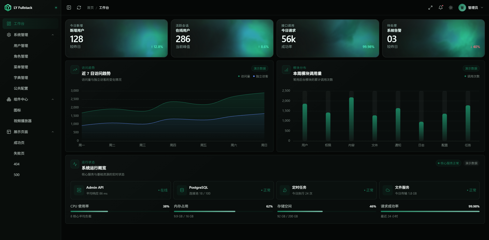

# 管理后台总览

`apps/admin` 是基于 Rsbuild 2、Vue 3、TypeScript、Element Plus、Pinia 和 Vue Router 的管理后台 SPA。它不是纯 UI 模板：登录会话、数据库菜单和系统管理接口已经与 `apps/admin-api` 真实贯通。



## 当前页面

- 工作台：指标卡片、访问趋势、模块调用量和系统运行概览展示。
- 用户管理：分页、筛选、新增、编辑、角色分配、密码重置和删除保护。
- 角色管理：角色 CRUD 与独立菜单授权。
- 菜单管理：树形菜单编辑、顺序调整、页面绑定和标准权限生成。
- 字典管理：字典与字典项维护。
- 公共配置：可供默认 C 端 API 匿名读取的非敏感配置。
- 组件中心：图标与视频播放器展示。
- 展示页面：成功、失败、404 和 500。

Dashboard 当前使用演示数据，不应把指标内容宣传成真实监控系统。

## 页面、组件与逻辑怎么分

```text
src/
├── views/<module>/index.vue          # 路由页面入口
├── views/<module>/components/        # 页面私有组件
├── views/<module>/composables/       # 页面私有业务编排
├── components/base/                  # 自动扫描的基础组件
├── components/business/              # 跨页面业务组件
├── components/layouts/               # 应用外壳组件
├── api/modules/<module>/             # API 路径与类型安全调用
├── services/                         # Axios 实例和拦截器
├── stores/modules/                   # 跨页面状态
├── router/modules/                   # 静态路由与页面绑定元数据
└── assets/styles/                    # 设计 token 和全局样式
```

页面入口只做结构与交互编排。列表请求、分页、筛选、删除和竞态处理放到 composable；复杂表单放到页面私有组件；只有被多个页面真实复用的稳定能力才提升到公共目录。

## 请求层

每个业务 API 模块通常包含：

```text
src/api/modules/user/
├── api.ts          # 路径常量与动态路径函数
├── interface.ts    # 请求函数、参数与响应类型
└── index.ts        # 聚合导出
```

调用函数复用管理服务实例。Token 注入、401 会话失效和 UI 反馈在服务基础设施与应用启动层统一装配，业务组件不直接创建 Axios，也不自行重复登录跳转逻辑。

## 认证状态

`useAuthStore` 持久化 Token、用户资料、菜单树和权限码，但 `sessionReady` 不持久化。浏览器刷新后，路由守卫仍会请求 `/auth/me`，用数据库最新状态覆盖本地快照。

这意味着“本地有 Token”只代表可以尝试恢复会话，不代表账号仍然有效。

## 路由与菜单

Admin 使用静态路由声明页面组件，数据库菜单控制当前用户可见导航与权限。只有声明 `meta.pageBinding` 的静态路由会进入菜单管理的页面选择器。

404 是布局下的兜底路由，不属于可配置菜单。登录页位于后台 Layout 之外。

## 自动导入边界

Vue、Vue Router、Pinia 常用运行时 API，以及 Element Plus Resolver 支持的组件和运行时 API可以自动导入。以下内容仍显式导入：

- TypeScript 类型；
- 业务组件、布局组件；
- 本地 composable、工具、常量和服务；
- Resolver 不负责的语言包等资源。

业务源码禁止手工导入 Element Plus 预编译 CSS，否则会绕过项目的 Sass 主题入口。

## 下一步

- [新增 CRUD 页面](/admin/crud-page)
- [菜单与权限接入](/admin/menu-permission)
- [主题与视觉规范](/admin/theme)
